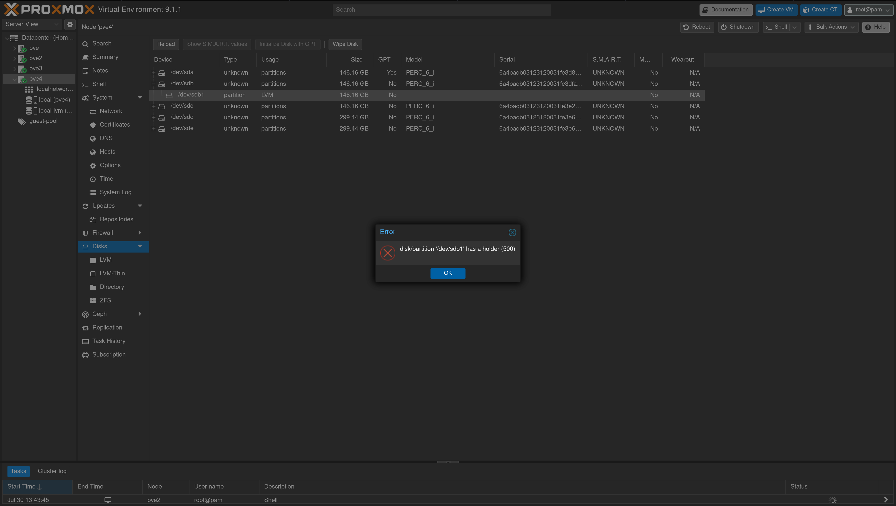

# [Proxmox] Impossible de wipe un disque : "has a holder (500)"

> **En résumé :** Le disque ne peut pas être effacé (wipe) via l'interface Proxmox car un élément du système l'utilise encore et bloque l'opération.

---

## Informations
- **Catégorie :** Proxmox
- **Date :** 2026-07-30
- **Système / Version :** Proxmox VE 8.4.0

---

## Erreur & Symptômes

En essayant de wipe un disque depuis l'interface web Proxmox (**Datacenter > Node > Disks > Wipe Disk**), le message suivant apparaît :

```
disk/partition '/dev/sdb1' has a holder (500)
```

Le disque `/dev/sdb1` (ou `sda`, `nvme0n1`, etc. selon les cas) refuse d'être wipé, alors que le disque ne semble pas monté explicitement dans le système.



---

## Cause du problème

Ce message signifie qu'un **"holder"** — un processus ou une couche logicielle — retient activement la partition. Cela arrive généralement quand le disque a déjà été utilisé auparavant.

Proxmox refuse de wipe le disque tant que cette ancienne configuration (le "holder") n'a pas été proprement supprimée, pour éviter de casser un stockage encore actif par erreur.

---

## Solution
 
**1. Identifier le holder avec `lsblk`**
 
```bash
lsblk
```
 
Cherche les entrées `lvm` ou `dm-` en dessous de la partition concernée (ex: `/dev/sdb1`). Le nom donne un indice sur l'origine (`ceph-...`, `pve-...`, nom de VG personnalisé, etc.).
 
Dans notre cas, `lsblk` a révélé que les disques `sdb` et `sdc` faisaient partie d'un **Volume Group LVM RAID1** (`payrollit-vg`), avec des LV mirorrés sur 2 disques chacun (`_rmeta_0/_rimage_0`).
 
**2. Vérifier le VG et ses LV avant toute suppression**
 
```bash
vgs
lvs payrollit-vg
```
 
Ici, `lvs` a confirmé 4 LV (`abds`, `bpa`, `data`, `vapbox`), tous en RAID1 (`rwi-a-r---`) et synchronisés à 100% (`Cpy%Sync 100.00`) — donc pas de resync en cours, opération sûre à ce niveau.
 
> **Avant de supprimer quoi que ce soit**, vérifier que ces LV ne sont plus utilisés par aucune VM/CT (`Datacenter > Storage`, `pvesm status`, ou `cat /etc/pve/storage.cfg`). La suppression est irréversible.
 
**3. Supprimer les LV, puis le VG**
 
```bash
lvremove payrollit-vg/abds
lvremove payrollit-vg/bpa
lvremove payrollit-vg/data
lvremove payrollit-vg/vapbox
 
vgremove payrollit-vg
```
 
`lvremove` demande une confirmation `y/n` pour chaque LV (car RAID actif) — c'est normal.
 
**4. Supprimer les Physical Volumes**
 
```bash
pvremove /dev/sdb1 /dev/sdc1
```
 
**5. Wipe des disques**
 
```bash
wipefs -fa /dev/sdb
```
 
**6. Relancer le wipe côté Proxmox**
 
Retourner dans l'interface Proxmox (**Disks > Wipe Disk**) pour confirmer que l'erreur "has a holder" a disparu.

---


## Liens & Références
- Forum Proxmox — discussions autour de l'erreur "has a holder (500)"
- Documentation Proxmox — gestion des disques (`pvesm`, `Disks` GUI)