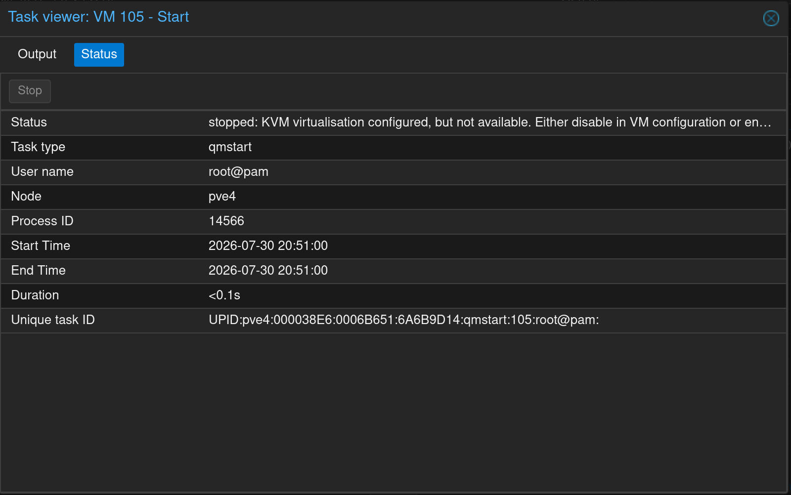
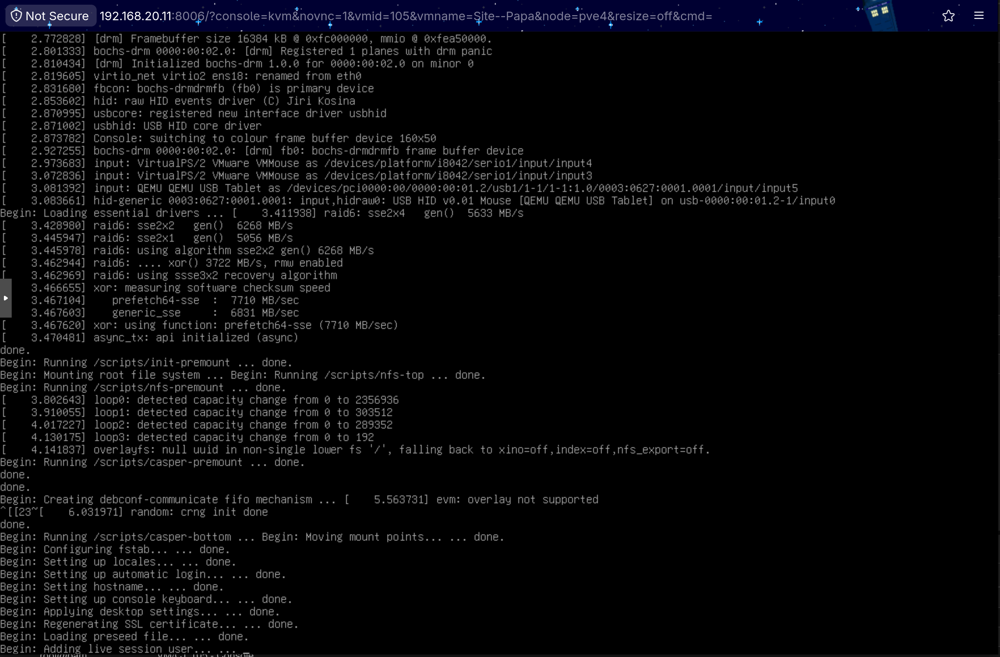

# [Proxmox] Erreur KVM : Virtualisation CPU désactivée

> **En résumé :** Lors du lancement d'une machine virtuelle sous Proxmox VE sur un serveur physique, la VM refuse de démarrer car la virtualisation technologique n'est pas activé dans le BIOS

---

## Informations

- **Catégorie :** Proxmox
- **Date :** 2026-07-30
- **Système / Version :** Proxmox VE 8.4.0

---

## Erreur & Symptômes

En essayant le lancer une VM que je viens de créer, j'ai eu ce code erreur:

```
TASK ERROR: KVM virtualisation configured, but not available. Either disable in VM configuration or enable in BIOS.
```



Le processeur (CPU) du serveur possède la capacité d'accélérer la virtualisation, mais que l'option est désactivée dans le BIOS du serveur

---

## Cause du problème

La très grande majorité des cartes mères (serveurs ou PC de bureau) sont livrées d'usine avec la technologie de virtualisation désactivée par défaut par mesure de sécurité.

Le processeur possède la technologie, mais le matériel interdit à Proxmox d'y accéder.

---

## Solution

**1. Redémarrer le serveur**

```bash
reboot
```

**2. Aller dans le BIOS via la touche**

Dell PowerEdge : **F2** (System Setup)

HPE ProLiant (HP) : **F9** (System Utilities)

Lenovo ThinkSystem : **F1** (Setup)

**3. Activer la virtualisation**

Si vous avez un processeur **INTEL**:

Cherchez **Intel Virtualization Technology**, **Intel VT-x** ou **Vanderpool** et passe le en **Enabled**

Si vous avez un processeur **AMD**:

Cherchez **SVM Mode** ou **AMD-V** et passe le en **Enabled**


**4. Sauvegarder et quitter**

Cliquez sur la touche exit indiqué dans le BIOS, ex: **F10**

**5. Relancer la VM**

La VM se lance parfaitement

