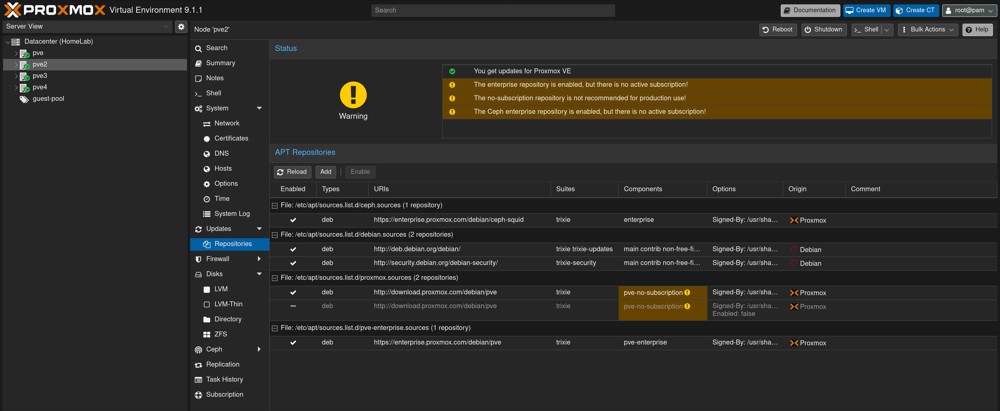
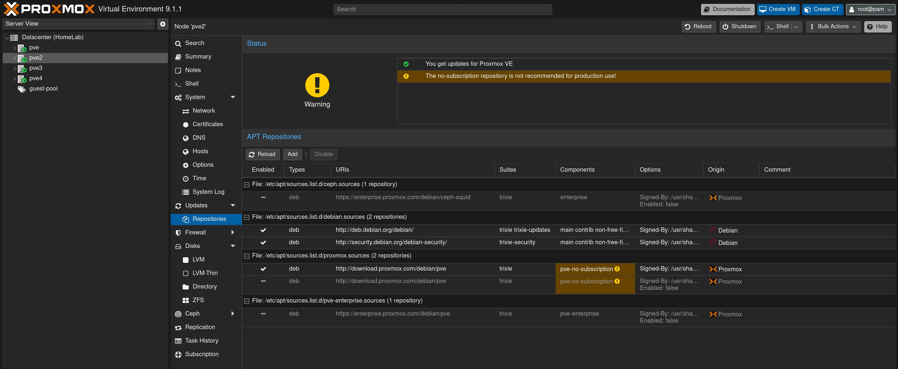
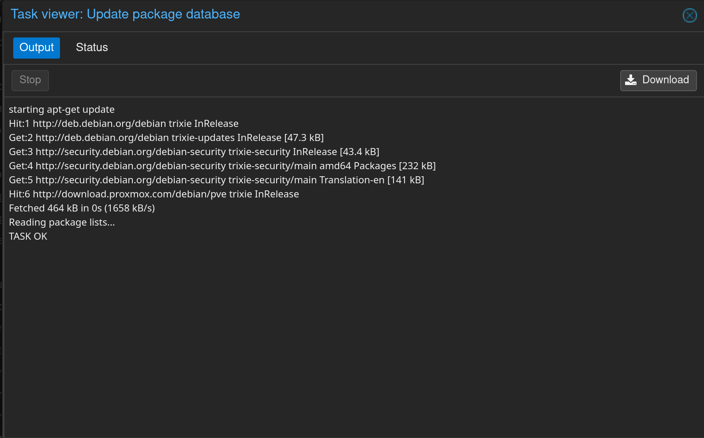

# [PROXMOX] Erreur 401 Unauthorized lors des mises à jour APT

> **En résumé :** Impossible de mettre à jour le noeud Proxmox VE en raison de l'activation par défaut des dépôts payants "Enterprise" sans abonnement valide.

---

## Informations

- **Catégorie :** Proxmox
- **Date :** 2026-08-06
- **Système / Version :** Proxmox 9.1.1

---

## Erreur & Symptômes

Lors de la tentative de rafraîchissement des paquets via l'interface graphique (**Updates** > **Refresh**) ou via le Shell (**apt update**), le processus échoue avec une erreur HTTP 401 Unauthorized.

```bash
starting apt-get update
Hit:1 http://deb.debian.org/debian trixie InRelease
Get:2 http://deb.debian.org/debian trixie-updates InRelease [47.3 kB]
Get:3 http://security.debian.org/debian-security trixie-security InRelease [43.4 kB]
Err:4 https://enterprise.proxmox.com/debian/ceph-squid trixie InRelease
  401  Unauthorized [IP: 51.91.38.34 443]
Hit:5 http://download.proxmox.com/debian/pve trixie InRelease
E: Failed to fetch https://enterprise.proxmox.com/debian/ceph-squid/dists/trixie/InRelease 401 Unauthorized
TASK ERROR: command 'apt-get update' failed: exit code 100
```

---

## Cause du problème

Par défaut, Proxmox VE est configuré avec les dépôts de mise à jour Enterprise (**pve-enterprise** et **ceph-enterprise**). Ces dépôts nécessitent un abonnement payant actif. Sans clé de licence renseignée, le serveur Proxmox distant rejette la connexion (Erreur 401).



---

## Solution

La solution consiste à désactiver les dépôts Enterprise payants et à utiliser le dépôt communautaire gratuit **pve-no-subscription**.

1. Identifier les dépôts Enterprise actifs

Allez dans votre **noeud** > **System** > **Repositories**. Vous constaterez que les dépôts Enterprise pour Ceph et PVE sont activés (présence d'une encoche).

2. Désactiver les dépôts Enterprise

- Sélectionnez la ligne du dépôt Ceph Enterprise (https://enterprise.proxmox.com/debian/ceph-squid) puis cliquez sur Disable.

- Sélectionnez la ligne du dépôt PVE Enterprise (https://enterprise.proxmox.com/debian/pve) puis cliquez sur Disable.

Une fois désactivées, ces deux lignes affichent un tiret **-** dans la colonne **Enabled**.



3. Recharger et mettre à jour

- Cliquez sur Reload en haut à gauche de la liste des dépôts.

- Allez dans l'onglet Updates puis cliquez sur Refresh.

- La mise à jour s'exécute désormais avec succès (**TASK OK**).



---

## Liens & Références
- Documentation officielle Proxmox : Proxmox VE Package Repositories

- Note : Le dépôt pve-no-subscription est recommandé pour les environnements de test, lab et hors-production.